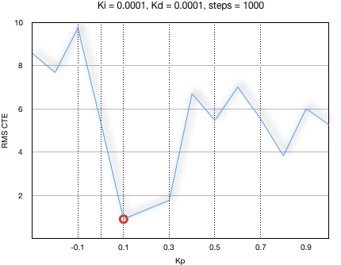
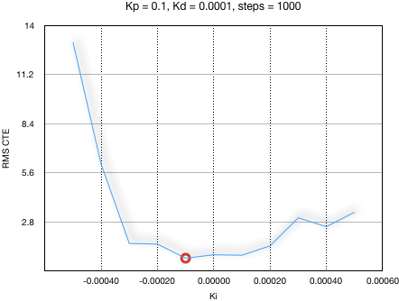
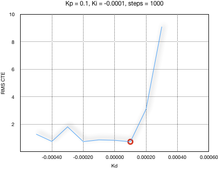
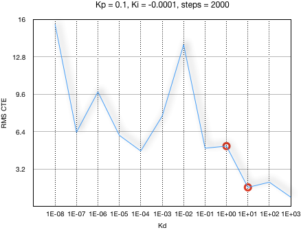
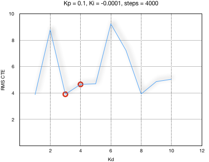

# CarND-Controls-PID
Self-Driving Car Engineer Nanodegree Program

---

## Reflection

### Describe the effect each of the P, I, D components had in your implementation.
* **P** component causes steering correction in proportion to the Cross Track Error. Increasing value of **Kp** increased the rate at which corrections are done. Very high value of this factor caused the vehicle to oscillate around the center of the lane. Very low value of this factor caused the vehicle to slow down corrections and vehicle started going outside the drivable surface around corners.
* **I** component considers accumulation of CTE over a period of time and corrects for that. Very high value of **Ki** caused over-steer even with low bias error value.
* **D** component considers rate of change of CTE and proportionally corrects for it. Very high value of **Kd** caused frequent and large steering corrections for even small errors and thus caused reduction in the speed of the vehicle, especially around corners.

### Describe how the final hyperparameters were chosen.

#### Twiddle from scratch

I tried to use Twiddle from scratch by setting `Kp, Ki, Kd = 0.0` and `dp = 1.0` but that did not work-out. Vehicle in the simulator kept going out of the road and getting stuck on railing. I then decided to figure out parameters with manual tunning and then perform twiddle on top of it.

#### Manual Tuning

##### Tunning for `Kp`

I set `Ki, Kd = 0.0001` and observed **RMS(CTE)** for 1000 steps by varying `Kp` from -0.3 to 1.0 and got following results. I selected **`Kp = 0.1`**.

#### Tunning for `Ki`

I set `Kp = 0.1, Kd = 0.0001` and observed **RMS(CTE)** for 1000 steps by varying `Ki` from -0.0005 to 0.0005 and got following results. I selected **`Ki = -0.0001`**.

#### Tunning for `Kd`

I set `Kp = 0.1, Ki = -0.0001` and observed **RMS(CTE)** for 1000 steps by varying `Kd` from -0.0005 to 0.0005 and got following results. Since the best value of `Kd` was still 0.0001 as before, I decided to change `Kd` by a factor of 10 to see the effect on CTE.

I varied `Kd` from 1e-8 to 1e+3 and got following results. Even though the error kept going down at 1e+3, the steering corrections in the simulator were very rapid and unnatural, something that a human drive will not do. Therefore, I decided to further investigate Kd in the range of 1 and 10.

I varied `Kd` from 1 to 10 and got following results. The best value was between 3 and 4. At this point I decided to let Twiddle fine tune further and come up with right values for `Kp`, `Kd` and `Ki`.

#### Fine Tunning with Twiddle

Input to twiddle was `Kp = 0.1`, `Ki = -0.0001`, `Kd = 3.0` and `dp = [0.01, 0.00001, 0.1]`. 

I tried to use twiddle for throttle control as well but did not get satisfactory results. I then manually came up with this formula `throttle = 0.1 + 0.6 * ((10 - fabs(angle)) / 10)` which increased the speed of the vehicle on straight patches and applied brake if the vehicle was about to go out of the drivable surface.

Final result of twiddle was following values for steering controller.

| Parameter | Value |
|-----------|-------|
| Kp | 0.30923 |
| Kd | 0.000103916 |
| Ki | 4.60079 |

### Simulation Result

Here's a video which shows the car driving around for three laps with above parameters.

